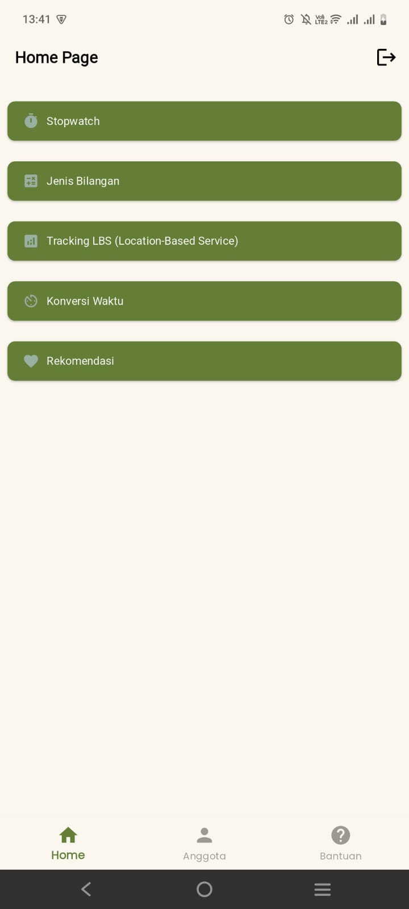

# Mobile - Tugas 3

Suruh buat aplikasi dengan ketentuan Soal

## Anggota

Anggota Pada Kelompok ini :

- Wijdan Akhmad S / 123220010 = [Github](https://github.com/Simad9)
- Aqsha Jauzaarafa S.H. / 123220016 = [Github](https://github.com/aqshajr)
- Vrida Pusparani / 123220082 = [Github](https://github.com/vridaa)

## Soal

Soal dapat diakses pada folder [`soal/Soal_Mobile_Tugas3.png`](soal/Soal_Mobile_Tugas3.png)

## Pembagian Tugas
Pembagian tugas ada di file ini : [`pembagian_tugas.md`](soal/pembagian_tugas.md)

## Setup API Keys
Untuk menggunakan aplikasi ini:

1. Copy file `android/local.properties.example` menjadi `android/local.properties`
2. Edit `local.properties` dan isi nilai `maps.api.key=` dengan Google Maps API Key Anda
3. Build aplikasi dengan perintah `flutter build apk` atau jalankan dengan `flutter run`

Catatan: File `local.properties` tidak akan diupload ke repository karena sudah ditambahkan ke .gitignore

## Screenshot Aplikasi

  
  
  

  
  
  

  
  
  

  
  

